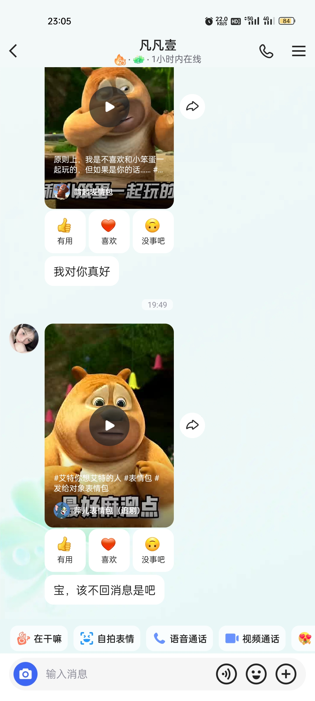

# 
标题

<!--  -->
## 问题
1. 我快手没有开通知，不能及时看到消息，很抱歉。

2. 打游戏我没有说不让你和男生玩，就是你组队我不在的情况下有男生跟我说一下就行了，不然我肯定会多想。你说了以后你想怎么玩都行，我自然也就不多想了。
3. 昨晚我和你玩游戏，我选了鲁班，因为我鲁班现在一个人很容易被抓，我当时想着你在了就能玩起来了，但是你却没跟我，到后面就容易被杀，你还到处浪，完全就是不配合我，我就很气。当然队友和我位置冲突了我也会换位置，到其它的位置了你也可以看着选对吧，主要是射手容易被杀，就想着让你帮下忙，我俩配合打肯定也比一个人玩的有意思，懂了吧。
4. 我生气了就懒得说话了，你还威胁我，就更气了，只能是尽量回你几句，这点确实是我的问题，我也想着就是早点解决喽，你越说越上头了，我还能说啥，就说睡觉呗。还好你最后说让我说清楚，那我不是才能知道你想解决问题嘛。

## 共同生存条例
### 状态阶段
#### 前言
两个人在一起，会有各种情况影响着，当然，在一个时间节点下状态是不会重复的，所以对应每种状态都有不同的条例，有些是随时可能改变但时间短，有些是按一定顺序的，先按顺序处理，然后对于随时可能改变但时间短的一些情况写在后面。
##### 15种状态
1. 第一阶段 相识
"相识"是恋爱的开始阶段，通常是通过共同的朋友、社交网络、工作场所等途径相识，然后开始交流。在这个阶段，双方都会比较谨慎，不会轻易地敞开心扉，也不会轻易地表露感情。他们会聊一些轻松的话题，比如兴趣爱好、生活情况等等，同时也会有一些约会，比如一起看电影、吃饭等等。人与人之间的任何一段关系都在认识这一步开始。
1. 第二阶段 朦胧期
"朦胧期"是谈恋爱的第一个阶段，这个阶段的特征是男女双方对彼此都有好感，不经意间就会去注意对方的行为举止。在这个阶段，双方开始进行相互了解，并寻求对方的关注和认可。这个阶段的恋爱特点是含蓄、羞涩，并且充满期待。
1. 第三阶段 热恋期
"热恋期"是谈恋爱的一个阶段，通常是恋爱的最初阶段，以彼此接触频繁，交往甚密，分分钟钟都想腻在一起为特点。在这个阶段，情侣们往往会感到无比甜蜜，容易满足，也容易培养感情。然而，这个阶段可能会给双方一种对方就是自己最合适的人的错觉。
1. 第四阶段 稳定期
"稳定期"是恋爱过程中的一个重要阶段。在这个阶段，双方开始逐渐了解对方的真实面貌，建立起更深入的信任和了解。他们会逐渐进入到互相扶持和支持的状态，一起处理生活中的各种问题和挑战。
1. 第四阶段 热恋时期
热恋时期是谈恋爱的第二个阶段，在这个阶段，情侣们已经十分熟悉了，并且已经有了肢体接触，比如拥抱和热吻。这个时期的情侣如胶似漆，一分钟也不想分开，一分钟不见如隔三秋一般。他们会山盟海誓，谁也不能把他们分开。
1. 第五阶段 平淡期
"平淡期"是谈恋爱过程中的一个阶段，它紧随在"热恋期"之后。在这个阶段，情侣之间对彼此的激情可能会有所消退，他们可能开始感到被冷落，并对对方的依赖减少。这可能导致他们在日常生活中更容易因为一些小事而争吵。
1. 第六阶段 磨合期
磨合期是恋爱中的一个阶段，它紧随热恋期之后。在这个阶段，情侣们开始更多地了解对方，双方的生活和习惯可能会有所融合，但也可能会出现一些磨合和矛盾。这个阶段的情侣可能会出现意见分歧和吵架，但通过沟通和妥协，他们会逐渐找到平衡点。
1. 第七阶段 约会
"约会"是谈恋爱过程中的一个重要阶段，通常在相识阶段之后。在这个阶段，双方开始有更多的互动，通过共同参与活动，如一起看电影、吃饭等，来更深入地了解对方，同时也在约会中展示自己的个性和优点。这个阶段的主要特点是双方开始逐渐接近，表达更多的感情，也会开始出现一些小的矛盾和问题，比如沟通不畅、性格不合等等。
1. 第八阶段 暧昧期
"暧昧期"是谈恋爱过程中的一个阶段，通常在"朦胧期"之后，"牵手期"之前。在这个阶段，男女双方虽然没有主动出击，但在生活中却彼此关怀。这个阶段可以被视为恋爱中最为微妙的阶段，因为双方可能在试探对方的感情，同时也在考虑自己的感情。
1. 第九阶段 成熟期
"成熟期"是谈恋爱的第四个阶段，也是最深入的一个阶段。在这个阶段，情侣们成功度过了恋爱阶段的冷战或争吵，能在爱情中体会彼此之间的优点，同时接纳对方的缺点。这意味着他们能重新回归甜蜜恋爱，从此顺利的走下去，或直到婚姻。
1. 第十阶段 婚姻
婚姻是谈恋爱的最后一个阶段，也就是“爱”的阶段。也是两个人未来生活的阶段。
1. 第十一阶段 相互了解的阶段
"相互了解的阶段"是谈恋爱的第一个阶段，也被称为"谈"的阶段。这个阶段是恋人心理交往的主要内容，是恋人最初级的交往特点。在这一阶段，双方进行相互了解，获得一般性信息，把握对方的价值观，并以较高的交往频率和交往质量为前提。
1. 第十二阶段 牵手期
"牵手期"是谈恋爱的第一个阶段，也是恋爱关系刚刚开始的阶段。在这个阶段，男女双方对彼此都有好感，某一方向另一方表白，正式的恋爱刚刚开始拉开帷幕。这个阶段的恋爱特点是双方进行相互了解，获得一般性信息，把握对方的价值观，并且必须以较高的交往频率和交往质量为前提。
1. 第十三阶段 恋爱初期
恋爱初期是谈恋爱的第一个阶段，通常是从双方相互有好感到确立关系后的前三个月左右。在这个阶段，男女双方在看见彼此时都会心跳加速，并开始注意自己的个人形象，尤其是在衣着打扮方面。双方都十分在意。
1. 随时可能改变但时间短的阶段 冷战期
"冷战期"是谈恋爱过程中的一个阶段，通常发生在恋爱双方发生争吵后，双方可能不再主动妥协或者包容对方，进入到一个冷战阶段。这个阶段可能导致恋爱关系的紧张和疏远，但也是一种磨合过程，如果双方能够成功度过冷战期，可能会进入到更成熟的恋爱阶段。